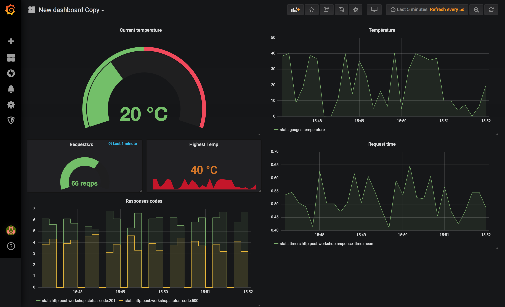

# metricsWorkshop

## Secnario

We have a temperature sensor in a room that records temp in a server. We want to monitor the temperature and server stats.

## Instructions

Start graphite and grafana

```
docker-compose up -d graphite grafana
```

Check on your browser: http://localhost:3010 .

user: admin
pwd: admin

Install server and sensor dependencies:

```
docker run -v $(pwd):/app node:11 bash -c "cd app && npm install"
```

Start your server and temperature sensor:

```
docker-compose up -d sensor server
```

If you change the code you can reload by doing:

```
docker-compose stop sensor server && docker-compose up -d sensor server
```

# First step

1. Create a simple temperature graph.
2. Create the responses code graph
3. Create the others graph that you see on the screenshot, start by your favorite
4. play with the sensor paramaters

# Goal

Create all the graphs present on the screenshot


You can always cheat and visual the whole board with the file `grafana-final.json`.

